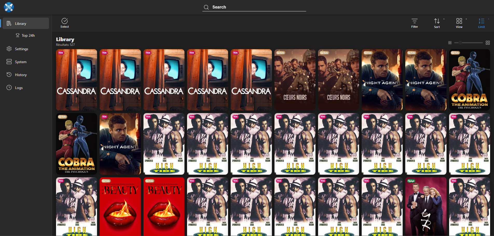
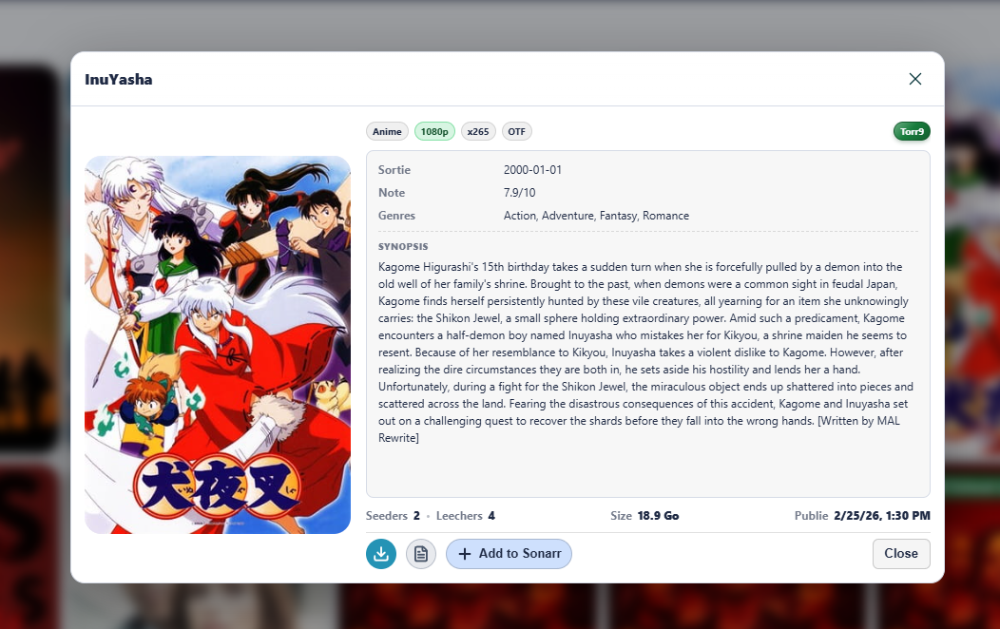
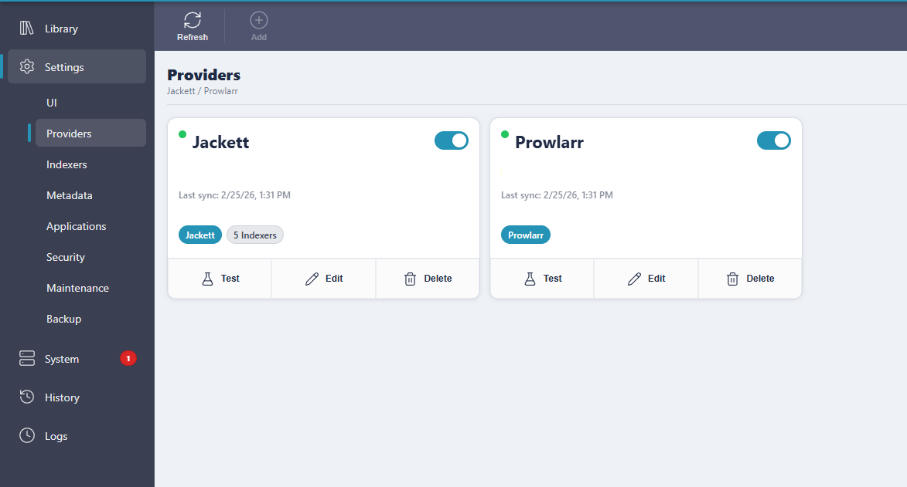

<p align="center">
  
</p>

<h1 align="center">Feedarr</h1>

<p align="center">
  <strong>Feedarr v2 — Architecture Monolithique</strong><br/>
  Feedarr fonctionne désormais en conteneur unique.<br/>
  L’ancienne architecture séparée (<code>feedarr-api</code> + <code>feedarr-web</code>) est obsolète.
</p>

<p align="center">
  Tableau intelligent de suivi des releases Torznab, Jackett et Prowlarr.
</p>

<p align="center">
  <a href="README.md">English</a> | Français (par défaut)
</p>

<p align="center">
  <a href="https://github.com/Guizmos/Feedarr/actions/workflows/docker-release.yml">
    
  </a>
  <a href="https://github.com/Guizmos/Feedarr/releases">
    
  </a>
  <a href="https://hub.docker.com/r/guizmos/feedarr">
    
  </a>
  <a href="LICENSE">
    
  </a>
</p>

<p align="center">
  <a href="#fonctionnalités">Fonctionnalités</a> |
  <a href="#installation">Installation</a> |
  <a href="#configuration">Configuration</a> |
  <a href="#développement">Développement</a> |
  <a href="#sécurité">Sécurité</a> |
  <a href="#captures-décran">Captures d’écran</a> |
  <a href="#support">Support</a> |
  <a href="#licence">Licence</a>
</p>

---

## Fonctionnalités

- Agrégation de flux Torznab via Jackett et Prowlarr
- Enrichissement des releases avec TMDB, TVmaze, Fanart, IGDB, etc.
- Affichage en bibliothèque avec posters et filtres avancés
- Gestion des providers, indexers et catégories depuis l’interface
- Intégration Sonarr / Radarr
- Système intégré de sauvegarde et restauration
- Assistant de configuration au premier lancement
- Stockage sécurisé des clés API (chiffrement au repos)
- SQLite optimisé avec pooling des connexions

---

## Installation

### Docker Compose (Monolithique)

Prérequis :

- Docker
- Docker Compose ou Portainer

```yaml
version: "3.9"

services:
  feedarr:
    container_name: FEEDARR
    image: guizmos/feedarr:latest
    restart: unless-stopped
    environment:
      ASPNETCORE_URLS: http://+:8080
      App__DataDir: /app/data
    volumes:
      - /volume1/Docker/Feedarr/data:/app/data
    ports:
      - "8888:8080"
```

Démarrage :

```bash
docker compose up -d
```

Points d’accès par défaut :

- Interface Web : `http://localhost:8888`
- API : `http://localhost:8888/api`
- Santé : `http://localhost:8888/health`

---

## Reverse Proxy

Feedarr fonctionne comme un service unique.

Configurer votre reverse proxy vers :

- `http://feedarr:8080`
- ou `http://<ip-hôte>:8888`

Le routage séparé `/api` n’est plus nécessaire.

La gestion HTTPS doit être assurée par le reverse proxy.

---

## Configuration

Au premier lancement, Feedarr reste verrouillé jusqu’à la fin de l’assistant (`/setup`).

Pour un déploiement WAN :

- Activer l’authentification
- Utiliser un reverse proxy TLS

Pages principales :

- Setup : `/setup`
- Paramètres généraux : `/settings`
- Providers : `/settings/providers`
- Services externes : `/settings/externals`
- Applications : `/settings/applications`
- Utilisateurs : `/settings/users`
- Sauvegarde / restauration : `/settings/backup`
- Indexers : `/indexers`

Guide détaillé:

- [English](docs/configuration-wizard.md)
- [Français](docs/configuration-wizard.fr.md)

---

## Développement

### Prérequis

- .NET SDK 8.x

### Lancement local (Monolithique)

```bash
dotnet run --project src/Feedarr.Api/Feedarr.Api.csproj -p:BuildWeb=true
```

Backend uniquement :

```bash
dotnet run --project src/Feedarr.Api/Feedarr.Api.csproj
```

---

## Migration depuis l’ancienne version (API + Web séparés)

1. Arrêter les anciens conteneurs
2. Supprimer les services `feedarr-api` et `feedarr-web`
3. Remplacer par le service unique `feedarr`
4. Conserver le volume `/app/data`
5. Redémarrer

Aucune migration de données requise.

---

## Sécurité

- Toutes les clés API externes sont chiffrées au repos
- Sources, Providers et applications ARR utilisent un chiffrement unifié
- Les sauvegardes anciennes et nouvelles sont compatibles
- Les credentials en clair sont automatiquement normalisés lors de la restauration
- Clés étrangères SQLite activées
- Limitation de débit sur endpoints sensibles
- Conçu pour être utilisé derrière un reverse proxy TLS

---

## Performance

- Pooling des connexions SQLite activé
- Optimisation des chemins asynchrones critiques
- Réduction des index redondants
- Amélioration de la stabilité des migrations et restaurations

---

## Captures d’écran

<table>
  <tr>
    <td></td>
    <td></td>
    <td></td>
  </tr>
</table>

---

## Support

- Issues : https://github.com/Guizmos/Feedarr/issues
- Releases : https://github.com/Guizmos/Feedarr/releases
- Documentation : `docs/`

---

## Licence

GNU GPL v3  
Voir `LICENSE` pour le texte complet.