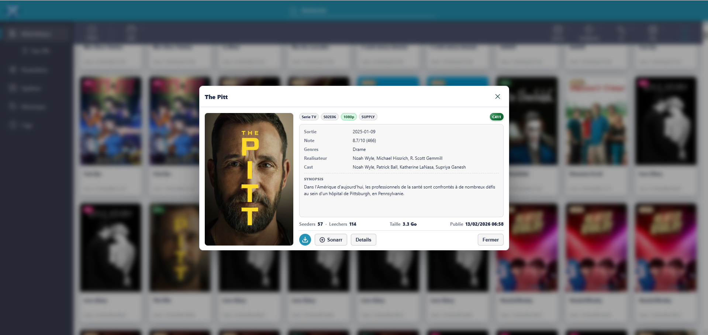
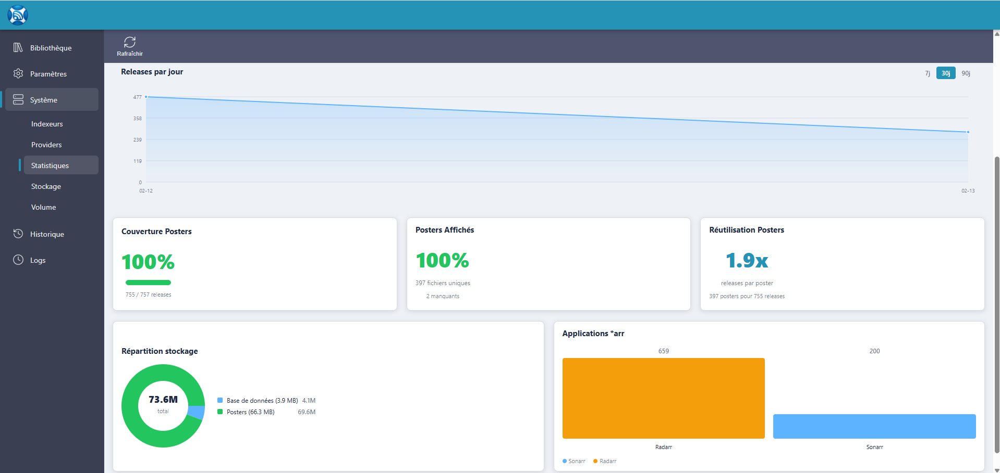
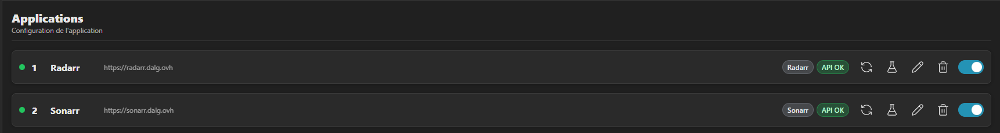
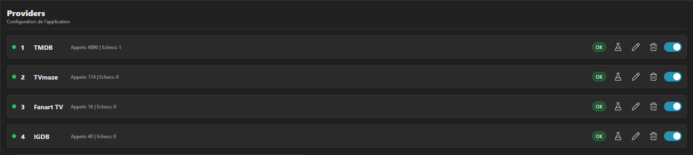
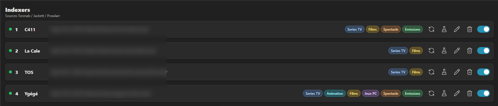
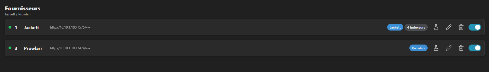
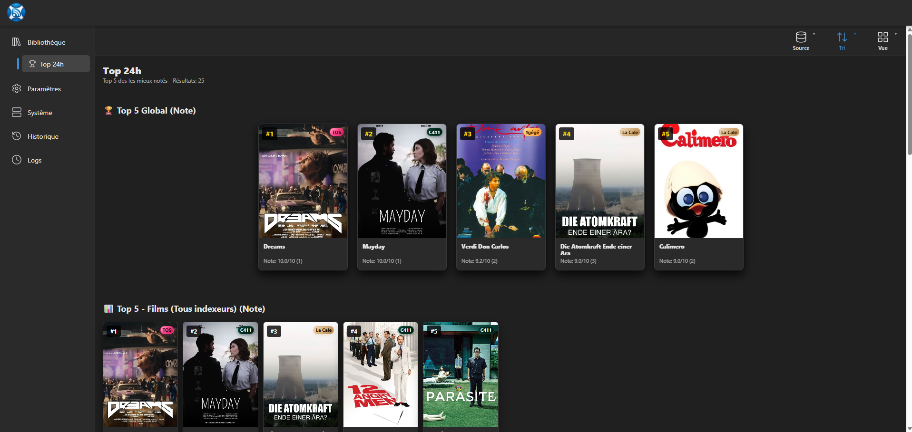
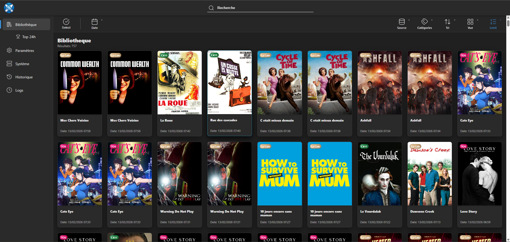

<table>
  <tr>
    <td width="96" valign="middle">
      
    </td>
    <td valign="middle">
      <h1>Feedarr</h1>
    </td>
  </tr>
</table>

Feedarr est une application self-hosted qui centralise des flux Torznab (Jackett/Prowlarr), enrichit les releases (posters + metadata), puis les expose dans une interface orientee bibliotheque.

## Captures d'ecran

<table>
  <tr>
    <td></td>
    <td></td>
    <td></td>
  </tr>
  <tr>
    <td></td>
    <td></td>
    <td></td>
  </tr>
  <tr>
    <td></td>
    <td></td>
    <td></td>
  </tr>
</table>

## Fonctionnalites principales

- Synchronisation RSS automatisee (sources Torznab).
- Parsing titres films/series/jeux.
- Enrichissement metadata via TMDB, TVmaze, Fanart et IGDB.
- Gestion des providers Jackett/Prowlarr depuis l'UI.
- Suivi activite, maintenance, nettoyage, backups/restores.
- Setup Wizard pour onboarding rapide.
- Integration Sonarr/Radarr (etat et synchronisation bibliotheque).

## Stack technique

- Backend: ASP.NET Core (.NET 8), Dapper, SQLite
- Frontend: React 19 + Vite 7
- Runtime: Docker (images API + Web separées)

## Structure du repository

- `src/Feedarr.Api`: API backend
- `src/Feedarr.Web/feedarr-web`: frontend React
- `docker/`: Dockerfiles + compose + config nginx
- `.github/workflows/`: pipeline CI/CD Docker + releases

## Demarrage rapide (Docker)

Prerequis:
- Docker + Docker Compose

Exemple `docker-compose.yml` (compatible Portainer, sans reseau externe obligatoire):

```yaml
version: "3.9"

services:
  api:
    container_name: FEEDARR-API
    image: guizmos/feedarr-api:latest
    restart: unless-stopped
    environment:
      ASPNETCORE_URLS: http://+:8080
      App__DataDir: /app/data
    volumes:
      - /volume1/Docker/Feedarr/data:/app/data
    ports:
      - "9999:8080"

  web:
    container_name: FEEDARR-WEB
    image: guizmos/feedarr-web:latest
    restart: unless-stopped
    depends_on:
      - api
    ports:
      - "8888:80"
```

Ports par defaut:
- Web: `http://localhost:8888`
- API: `http://localhost:9999`

Persistance:
- Les donnees API sont montees vers `/app/data` (SQLite, posters, backups, cles).
- Adapte le chemin host `/volume1/Docker/Feedarr/data` a ton environnement.

Si tu utilises deja un reseau externe custom (ex: `docker_net`), tu peux l'ajouter en option:

```yaml
services:
  api:
    networks:
      - docker_net
  web:
    networks:
      - docker_net

networks:
  docker_net:
    external: true
```

Lancement en CLI:

```bash
docker compose up -d
```

## Demarrage local (developpement)

Prerequis:
- .NET SDK 8.x
- Node.js 18+

Backend:

```bash
dotnet run --project src/Feedarr.Api/Feedarr.Api.csproj
```

Frontend:

```bash
cd src/Feedarr.Web/feedarr-web
npm install
npm run dev
```

Le frontend proxifie `/api` vers `http://localhost:5003`.

## Configuration

Variables d'environnement utiles cote API:

- `ASPNETCORE_URLS` (ex: `http://+:8080`)
- `App__DataDir` (ex: `/app/data`)
- `App__DbFileName` (default: `feedarr.db`)
- `App__SyncIntervalMinutes`
- `App__RssLimit`
- `App__RssLimitPerCategory`
- `App__RssLimitGlobalPerSource`
- `App__Security__EnforceHttps`
- `App__Security__EmitSecurityHeaders`
- `App__RateLimit__Stats__PermitLimit` (default: `120`)
- `App__RateLimit__Stats__WindowSeconds` (default: `60`)
- `App__ReverseProxy__TrustedProxies__0`
- `App__ReverseProxy__TrustedNetworks__0`

Les cles externes (TMDB/Fanart/IGDB/TVmaze) se configurent dans l'UI (`Settings > External`).

## Securite

- Protection des cles API externes (Data Protection + chiffrement local).
- Basic Auth disponible (configurable dans `Settings > Security`).
- Headers de securite emis par l'API.
- Validation des URLs entrantes pour limiter les abus.
- Rate limiting sur les endpoints statistiques lourds (`429` en cas d'exces).

Important:
- Par defaut, l'authentification est desactivee (`authentication = none`).
- Pour une exposition Internet, activer l'auth (`basic` + mot de passe fort) et placer Feedarr derriere un reverse proxy TLS.

## Verification qualite

Backend:

```bash
dotnet build src/Feedarr.Api/Feedarr.Api.csproj -c Release
dotnet test src/Feedarr.Api.Tests/Feedarr.Api.Tests.csproj -c Release
```

Frontend:

```bash
cd src/Feedarr.Web/feedarr-web
npm run test
npm run lint
npm run build
```

## Endpoints utiles

- `GET /api/system/status`
- `GET /api/system/storage`
- `GET /api/system/stats/*`
- `GET /api/system/backups`
- `POST /api/system/backups`
- `POST /api/system/backups/{name}/restore`

## Statut de maturite

Niveau recommande actuel: **beta auto-hebergee**.

Avant un lancement public large, prioriser:

- Pipeline CI avec build + tests automatiques avant publication Docker.
- Politique de securite par defaut plus stricte (auth activee / guide hardening).
- Clarification licence du projet.
- Stabilisation tooling .NET (pin SDK via `global.json`).

## Licence

Licence non definie pour le moment.
