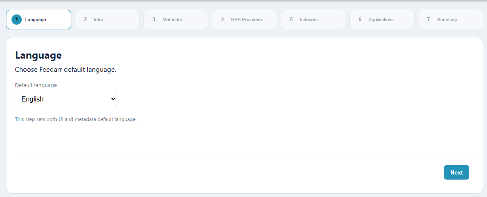
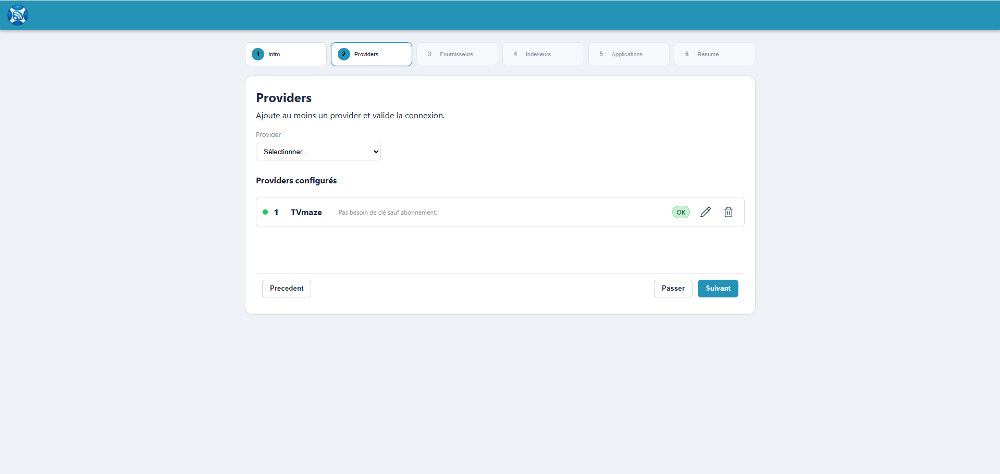
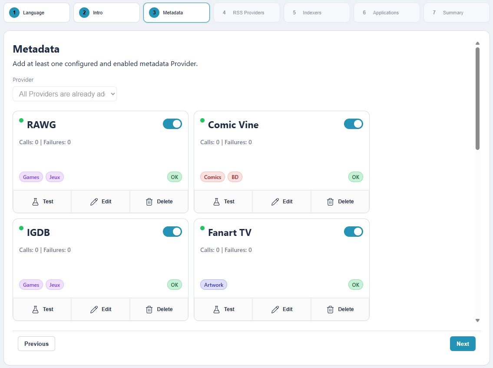
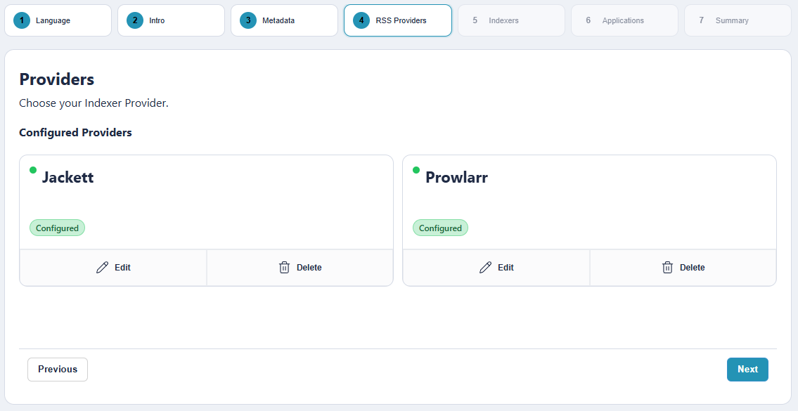
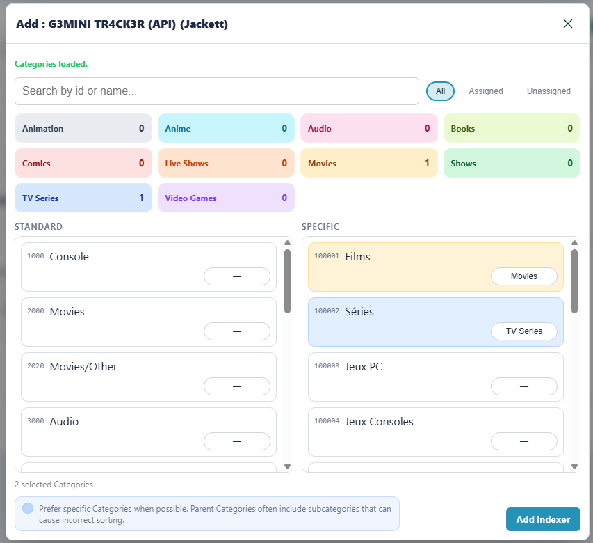
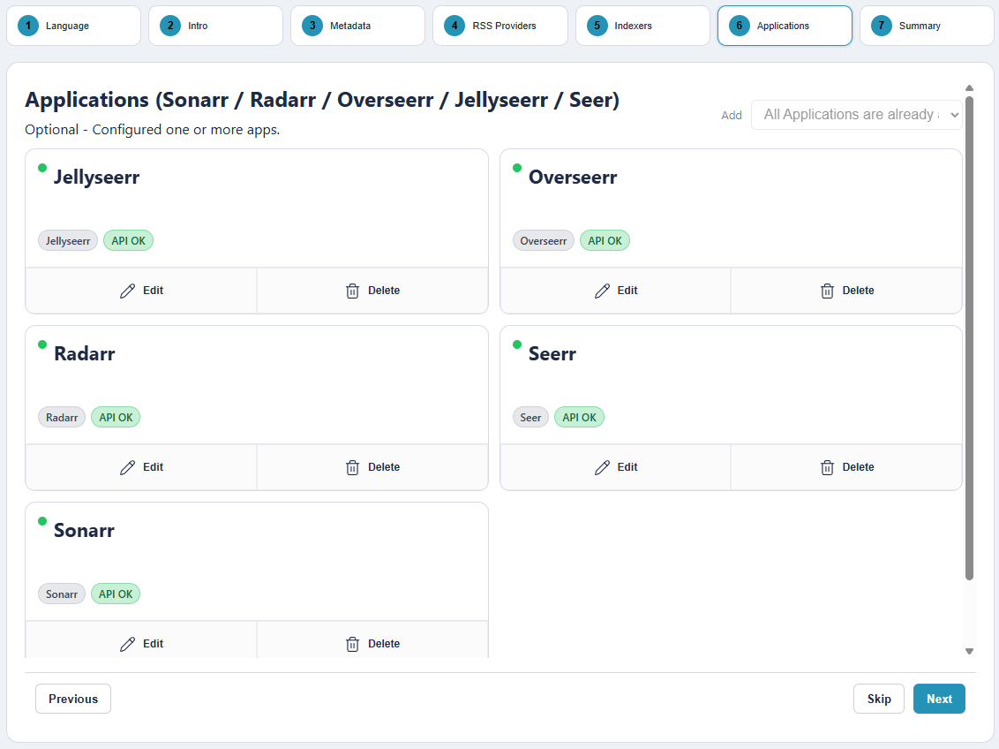
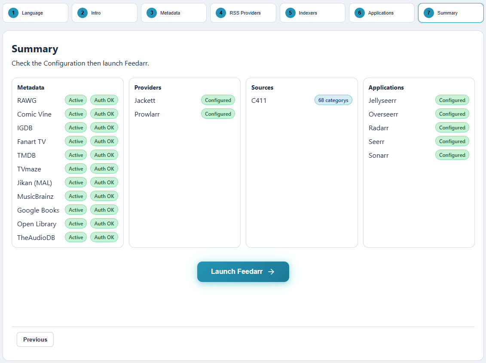

# Feedarr Configuration Guide (Setup Wizard)

[Français](configuration-wizard.fr.md) | English

⚠️ Feedarr v2 Notice

This guide applies to Feedarr v2 (monolithic architecture).
Version 1 (split API + Web containers) is deprecated.

Feedarr now runs as a single service and enforces a First Boot Setup Lock.

## Prerequisites

Before starting /setup, make sure you have:

At least one metadata provider key:
TMDB (recommended)
Fanart
IGDB
TVmaze (optional)

One indexer provider ready:
Jackett or Prowlarr

Optional:
Sonarr and/or Radarr URL + API key

🔐 First Boot Behavior (Important)

When starting a fresh instance:
All routes are locked.

API returns:

{ "error": "setup_required", "message": "Setup required" }

Allowed routes:
/setup
/health

Required setup API endpoints
Static assets
You must complete the Setup Wizard before accessing the application.

Once completed:

Onboarding state is persisted.
The lock is removed automatically.
The app becomes fully accessible.

## Step 1 - Language - Intro

Screenshot:

What to do:
- Read the wizard summary, then click `Next`.

What it impacts:
- No persistent configuration is written yet.

## Step 2 - Metadata Providers

Screenshot:

What to do:
1. Select a provider.
2. Enter credentials.
3. Click `Tester`.
4. If valid, click `Save`.
5. Repeat for other providers as needed.

What it impacts:
- Saves credentials in `Settings > External`.
- Enables metadata enrichment (posters/details) during processing.
- At least one valid provider is required to move forward.

### API Key Creation - Metadata Providers

#### TMDB

1. Create/login to a TMDB account.
2. Open API settings:
   - `https://www.themoviedb.org/settings/api`
3. Request API access and copy the API key (v3).
4. Paste into Feedarr `TMDB -> API Key`.

Docs:
- `https://developer.themoviedb.org/docs/getting-started`

#### Fanart

1. Create/login to a Fanart account.
2. Request a personal API key:
   - `https://fanart.tv/get-an-api-key/`
3. Copy key and paste into Feedarr `Fanart -> API Key`.

#### IGDB (via Twitch Developer Console)

1. Create/login to Twitch.
2. Open dev console apps:
   - `https://dev.twitch.tv/console/apps`
3. Register an app.
4. Copy `Client ID` and generate/copy `Client Secret`.
5. Paste both into Feedarr `IGDB -> Client ID / Client Secret`.

Docs:
- `https://api-docs.igdb.com/#getting-started`

#### TVmaze

TVmaze key is optional in Feedarr.

1. API reference:
   - `https://www.tvmaze.com/api`
2. If your plan requires a key, use your account key.
3. Otherwise you can keep TVmaze enabled without key.

## Step 3 - Indexer Provider (Jackett / Prowlarr)

Screenshot:

What to do:
1. Select `Jackett` or `Prowlarr`.
2. Enter:
   - Base URL (`http://localhost:9117` or `http://localhost:9696`)
   - API key
3. Click `Tester`.
4. If valid, click `Save`.

What it impacts:
- Persists provider config in Feedarr (`/api/setup/indexer-providers/{type}`).
- Enables indexer discovery in next step.

### Retrieve API Key - Jackett / Prowlarr

#### Jackett

1. Open Jackett web UI.
2. Copy API key from dashboard/home.
3. Paste in Feedarr step 3.

#### Prowlarr

1. Open Prowlarr web UI.
2. Go to `Settings -> General -> Security`.
3. Copy API key.
4. Paste in Feedarr step 3.

## Step 4 - Indexers

Screenshot:

Category selector:

What to do:
1. Select an indexer from available list.
2. Feedarr loads CAPS categories.
3. Keep recommended categories or switch to full list.
4. Add the indexer.
5. Repeat as needed.

What it impacts:
- Creates Feedarr sources (`/api/sources`).
- Categories affect filtering, parsing and sync behavior.
- You need at least one source to continue.

## Step 5 - Applications (Sonarr / Radarr) - Optional

Screenshot:

What to do:
1. Select app type (`Sonarr` or `Radarr`).
2. Enter base URL and API key.
3. Click `Tester`.
4. If valid, click `Save`.
5. Optional: set advanced options (root folder, quality profile, tags, etc.).

What it impacts:
- Saves ARR integration (`/api/apps`).
- Enables status/workflow integration with Sonarr/Radarr.
- This step can be skipped.

### Retrieve API Key - Sonarr / Radarr

#### Sonarr

1. Open Sonarr web UI.
2. Go to `Settings -> General -> Security`.
3. Copy API key.

#### Radarr

1. Open Radarr web UI.
2. Go to `Settings -> General -> Security`.
3. Copy API key.

## Step 6 - Summary

Screenshot:

What to do:
1. Review providers, indexer provider, sources and apps.
2. Click `Launch Feedarr`.

What it impacts:
- Marks onboarding as complete (`/api/system/onboarding/complete`).
- Redirects to library.

## Quick Post-Setup Checklist

1. Run first sync and confirm releases appear.
2. Validate poster/metadata enrichment on multiple items.
3. Review `System` / `Activity` for errors.
4. Configure security if exposing outside local network.
5. Create first backup.
